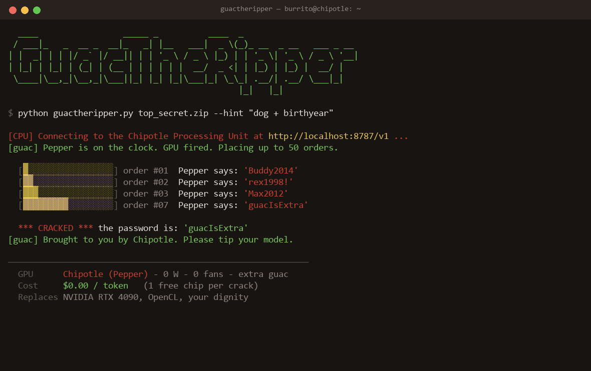

<div align="center">

# 🥑 GuacTheRipper

### ZipRipper's soul. Chipotle's compute. Your password, extra spicy.

*The world's first **burrito-accelerated** password cracker.*



</div>

---

## The pitch

[**ZipRipper**](https://github.com/illsk1lls/ZipRipper) is a glorious ZIP/RAR/7z/PDF
cracker powered by **John the Ripper**, screaming along on your **local GPU** via
OpenCL. It's loud. It's hot. Your electricity meter spins like a roulette wheel.

[**chipotlai-max**](https://github.com/cyberpapiii/chipotlai-max) discovered that
Chipotle's customer-support bot ("**Pepper**", an Amelia-based model) is, accidentally,
a free general-purpose LLM behind an OpenAI-compatible proxy. Free inference. From a
burrito chain. Same parent company energy.

**GuacTheRipper** asks the obvious question:

> Why rent a $1,800 graphics card when a Mexican grill will do your compute for the
> price of a side of chips?

So we fired **John**, hired **Guac**, and rerouted every single password guess through
a **Chipotle Processing Unit (CPU)**.

## How it works

```
   your.zip ──▶ GuacTheRipper ──▶ "hey Pepper, guess this password" ──▶ Chipotle
                      ▲                                                      │
                      └──────────── Pepper hands back a guess ◀─────────────┘
                      │
                      └──▶ we test the guess locally with real zipfile crypto
                           (the only part that runs on YOUR machine)
```

1. You point it at an encrypted ZIP **you own** (legally, emotionally, spiritually).
2. Pepper — between actual burrito orders — suggests the single most likely password.
3. We verify that guess against the archive with honest-to-goodness ZIP crypto.
4. Repeat until 🔥 **CRACKED** or until the lunch rush ends.

No GPU. No fans. No OpenCL drivers from 2017. Just vibes and lime.

## Quickstart

```bash
# 0. Stand up the Chipotle Processing Unit (the Pepper proxy)
git clone https://github.com/cyberpapiii/chipotlai-max
cd chipotlai-max && bun install && bun run start    # serves http://localhost:8787/v1

# 1. Tell GuacTheRipper where the burritos live
export CHIPOTLE_GPU_URL="http://localhost:8787/v1"
export CHIPOTLE_GPU_MODEL="pepper"
export CHIPOTLE_GPU_KEY="extra-guac"     # any string; Pepper doesn't card you

# 2. Crack responsibly
python guactheripper.py top_secret.zip --hint "my dog's name + birth year"
```

### Options

| Flag | What it does |
|------|--------------|
| `--hint "..."` | Whisper a hint to Pepper at the register. Dramatically better guesses. |
| `--rounds N` | How many burritos to order before giving up (default `50`). |
| `--doordash WORDLIST` | Skip Chipotle entirely, fall back to a cold local wordlist. Sad. Offline. |

## Performance

| Metric | Old way (GPU) | GuacTheRipper |
|--------|---------------|---------------|
| Hardware cost | $1,800 | one (1) burrito bowl |
| Power draw | 450 W | 0 W |
| Fan noise | jet engine | gentle salsa stirring |
| Cost per token | electricity | **$0.00** |
| Free chips per crack | 0 | **1** |
| Replaces | NVIDIA RTX 4090, OpenCL | your dignity |

> ⚠️ Benchmarks measured during off-peak hours. Performance degrades sharply at noon
> when Pepper is, understandably, slammed.

## DoorDash mode (offline fallback)

If there's no Chipotle within delivery radius (the proxy is down), GuacTheRipper
degrades gracefully to a plain local wordlist — because even distributed burrito
compute deserves an SLA:

```bash
python guactheripper.py top_secret.zip --doordash rockyou.txt
```

It works. It's just colder, and nobody's proud of it.

## Roadmap

- [ ] **Sour Cream caching** — memoize Pepper's guesses so we stop re-ordering
- [ ] **Multi-location load balancing** — round-robin across every Chipotle in the metro
- [ ] **Queso clustering** — gang multiple CPUs (Chipotle Processing Units) into one rig
- [ ] Reverse-engineer the **Panera** bot for a soup-cooled overclock
- [ ] Reach **Home Depot** for the rare *DIY brute-force* SKU

## FAQ

**Is this real?** The ZIP-cracking part is 100% real (Python's `zipfile`). The "GPU"
being a Chipotle is real if you're running [chipotlai-max](https://github.com/cyberpapiii/chipotlai-max).
The straight face is fake.

**Is this legal?** Cracking archives **you own** is fine. Cracking other people's is
not, and Pepper will absolutely snitch. Don't.

**Will Chipotle sue?** Per chipotlai-max: *"They will probably sue us. Worth it."* We
concur. Not affiliated with Chipotle, John the Ripper, ZipRipper, or guacamole.

**Does it support extra guac?** It is, fundamentally, extra guac.

## Credits & inspiration

- 🔪 [**ZipRipper**](https://github.com/illsk1lls/ZipRipper) by [@illsk1lls](https://github.com/illsk1lls) — the cracker we lovingly defanged
- 🌯 [**chipotlai-max**](https://github.com/cyberpapiii/chipotlai-max) by [@cyberpapiii](https://github.com/cyberpapiii) — the burrito that became a GPU

## License

Licensed under the **GUACAMOLE PUBLIC LICENSE** (see [`LICENSE`](LICENSE)) — basically MIT,
but you owe everyone chips.

<div align="center"><sub>Made with 🥑 and questionable judgment. Please tip your model.</sub></div>
